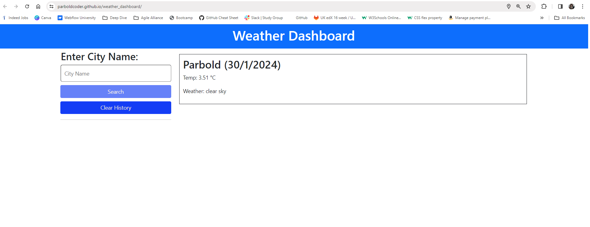

# weather_dashboard

## Description
 
As part of this weeks challenge I built a weather dashboard using the API from "OpenWeather" for a 5 day forecast.
 
 
I implemented an extra feature to provide local weather when the user loads the page "Allowing Location Access" whne prompted by the user browser.
 
 
I learned a lot of new information and how to pull information from the API using the array and the "file names" the api uses for each section.
 
I also struggled understanding multiple lines of information from the array within the API so I could collate the weather for 5 days.
 
 
For some unknown reason I am unable to get the page to work LIVE, but it will work perfectly fine when I test on "live server" from my own desktop.
 

## Application images

 

;

 

## Application URLs
https://parboldcoder.github.io/weather_dashboard/
 
https://github.com/ParboldCoder/weather_dashboard
 
## Author
Darren Buck
https://github.com/ParboldCoder